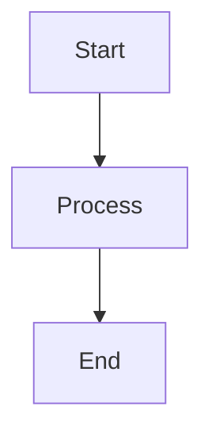

# Contributing to RedAgent

Thank you for your interest in contributing to RedAgent! We welcome contributions from everyone. This document provides guidelines and instructions for contributing.

## 🎯 How to Contribute

### 1. Reporting Issues
- Check if the issue already exists in the [Issues](https://github.com/Insider77Circle/Red-Agent/issues) section
- Use the issue templates if available
- Provide detailed information:
  - RedAgent version
  - Python version
  - Steps to reproduce
  - Expected vs actual behavior
  - Error messages or logs

### 2. Feature Requests
- Explain the problem you're trying to solve
- Describe your proposed solution
- Provide use cases and examples
- Consider if the feature aligns with RedAgent's goals

### 3. Code Contributions
- Fork the repository
- Create a feature branch
- Make your changes
- Add tests if applicable
- Ensure code follows our style guide
- Submit a pull request

## 🛠️ Development Setup

### Prerequisites
- Python 3.11 or higher
- Git
- DeepSeek API key (for testing)

### Setup Steps
```bash
# Fork and clone the repository
git clone https://github.com/your-username/Red-Agent.git
cd Red-Agent

# Create virtual environment
python -m venv venv

# Activate virtual environment
# On Windows:
venv\Scripts\activate
# On macOS/Linux:
source venv/bin/activate

# Install dependencies
pip install -r requirements.txt
pip install -r requirements-dev.txt  # Development dependencies

# Create environment file
cp .env.example .env
# Add your DeepSeek API key to .env
```

### Running Tests
```bash
# Run all tests
pytest tests/ -v

# Run specific test file
pytest tests/test_proxy_pool.py -v

# Run with coverage
pytest --cov=redagent tests/ -v
```

## 📝 Code Style

### Python Style Guide
We follow [PEP 8](https://www.python.org/dev/peps/pep-0008/) with some additions:

- **Line length**: 88 characters (Black formatter default)
- **Imports**: Group in this order:
  1. Standard library imports
  2. Third-party imports
  3. Local application imports
- **Type hints**: Use type hints for all function signatures
- **Docstrings**: Use Google style docstrings

### Formatting Tools
We use several tools to maintain code quality:

```bash
# Format code with Black
black .

# Sort imports with isort
isort .

# Check code style with flake8
flake8 redagent/

# Type checking with mypy
mypy redagent/
```

### Pre-commit Hooks
Install pre-commit hooks to automatically format code:

```bash
pip install pre-commit
pre-commit install
```

## 🏗️ Project Structure

Understanding the project structure will help you contribute:

```
redagent/
├── agent/           # AI chat session management
├── proxy/           # Proxy management core
├── security/        # Security auditing tools
├── observability/   # Monitoring and metrics
└── data/            # Persistent storage
```

### Adding New Tools
RedAgent uses a tool registry system. To add a new tool:

1. Create a new module in the appropriate directory
2. Define your tool function with proper type hints
3. Create a registration function
4. Import and register in main.py

Example tool structure:
```python
# In your_module.py
from pydantic import BaseModel, Field
from agent.tools import ToolRegistry

class YourToolParams(BaseModel):
    param1: str = Field(description="Description of param1")
    param2: int = Field(default=10, description="Description of param2")

def register_your_tools(registry: ToolRegistry):
    @registry.register(
        name="your_tool",
        description="What your tool does",
        parameters_model=YourToolParams,
    )
    def your_tool(param1: str, param2: int = 10) -> dict:
        # Tool implementation
        return {"result": "success"}
```

## 🧪 Testing

### Writing Tests
- Place tests in the `tests/` directory
- Use descriptive test names
- Test both success and failure cases
- Mock external API calls

### Test Structure
```python
import pytest
from redagent.proxy.pool import ProxyPool

def test_proxy_pool_initialization():
    """Test that ProxyPool initializes correctly."""
    pool = ProxyPool()
    assert pool.proxies == []
    # More assertions...

@pytest.mark.asyncio
async def test_async_operation():
    """Test asynchronous operations."""
    result = await some_async_function()
    assert result == expected_value
```

## 📚 Documentation

### Updating Documentation
- Update README.md for major changes
- Add docstrings to new functions/classes
- Update example commands if behavior changes
- Keep diagrams current with architecture changes

### Creating Diagrams
We use Mermaid.js for diagrams in README.md:


## 🔄 Pull Request Process

1. **Create a branch**: Use descriptive names like `feature/add-tor-support` or `fix/dns-leak-detection`
2. **Make changes**: Follow the code style and add tests
3. **Update documentation**: Update README.md and docstrings
4. **Run tests**: Ensure all tests pass
5. **Submit PR**: Fill out the PR template completely

### PR Checklist
- [ ] Tests added/updated
- [ ] Documentation updated
- [ ] Code follows style guide
- [ ] No breaking changes (unless discussed)
- [ ] All checks pass

## 🏷️ Versioning

We use [Semantic Versioning](https://semver.org/):
- **MAJOR**: Breaking changes
- **MINOR**: New features (backward compatible)
- **PATCH**: Bug fixes (backward compatible)

## 🐛 Common Issues

### API Key Issues
- Ensure your DeepSeek API key is valid
- Check rate limits
- Verify network connectivity

### Proxy Testing Failures
- Some proxies may be temporarily unavailable
- Use mock data for development
- Implement retry logic

### Async/Await Problems
- Ensure proper async/await usage
- Use `pytest.mark.asyncio` for async tests
- Handle exceptions in async functions

## 🤝 Community

### Communication
- Be respectful and inclusive
- Assume good intentions
- Provide constructive feedback
- Help others when possible

### Getting Help
- Check existing documentation
- Search closed issues
- Ask in discussions
- Join our community chat (if available)

## 📄 License

By contributing, you agree that your contributions will be licensed under the MIT License.

## 🙏 Thank You!

Your contributions help make RedAgent better for everyone in the cybersecurity community. Thank you for your time and effort!

---

*"Together, we build better tools for a safer digital world."*