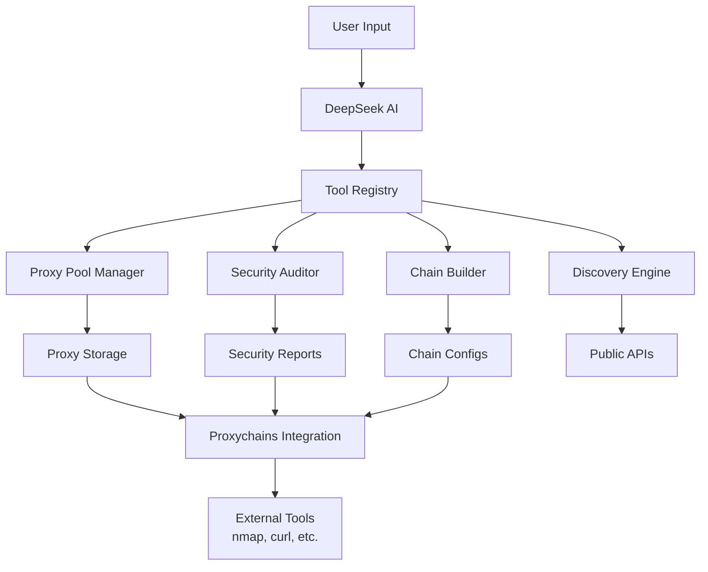
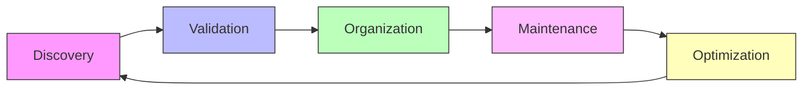
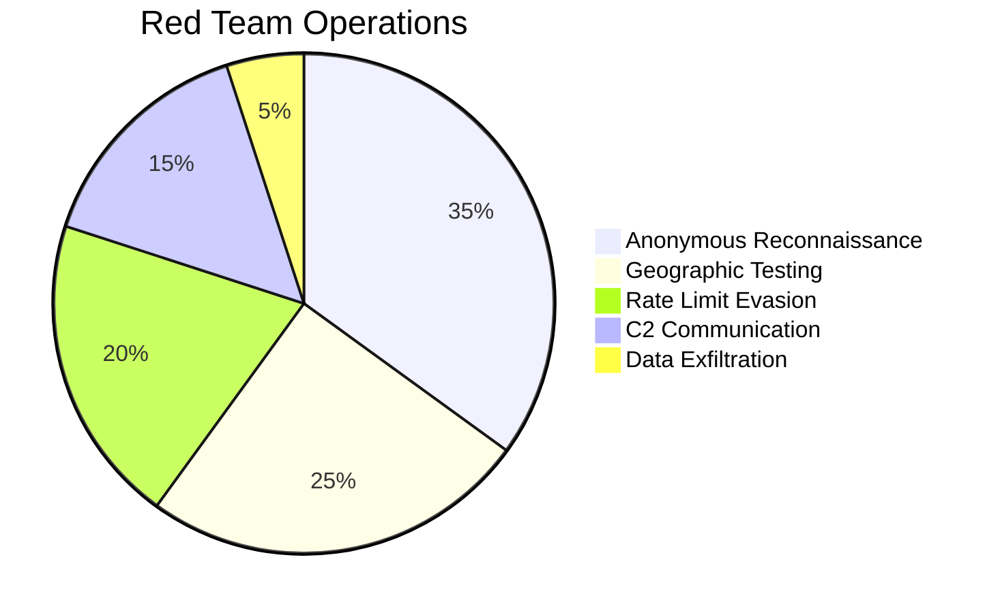

# RedAgent 🤖🔒

**AI-Powered Proxy Management for Cybersecurity Professionals**

[](https://www.python.org/downloads/)
[](https://opensource.org/licenses/MIT)
[](https://github.com/Insider77Circle/Red-Agent)

RedAgent transforms complex proxy management into simple conversations. Using natural language processing with DeepSeek AI, it automates proxy discovery, security auditing, chain building, and integration with security tools like nmap and proxychains.

## 🎯 Why RedAgent?

Traditional proxy management requires memorizing complex commands and manual configuration. RedAgent revolutionizes this by:

- **Understanding intent** through natural language
- **Automating tedious tasks** like proxy discovery and testing
- **Providing security assurance** through comprehensive auditing
- **Integrating seamlessly** with existing security tools

## 🎬 Demo

https://github.com/Insider77Circle/Red-Agent/raw/main/assets/redagent-demo.mp4

## 🚀 Quick Start

### Installation
```bash
# Clone the repository
git clone https://github.com/Insider77Circle/Red-Agent.git
cd Red-Agent

# Install dependencies
pip install -r requirements.txt

# Configure environment
cp .env.example .env
# Add your DeepSeek API key to .env file

# Run RedAgent
python main.py
```

### Your First Command
```
"Find me fast proxies and check for DNS leaks"
```

## 📊 Architecture Overview



## 🎨 Features

### 🤖 AI-Powered Natural Language Interface
- **Conversational Commands**: "Build me a 3-hop chain through Europe"
- **Context Awareness**: Remembers previous commands and maintains conversation flow
- **Rich Terminal UI**: Beautiful console output with panels, tables, and formatted responses

### 🔄 Complete Proxy Lifecycle Management


### 🛡️ Advanced Security Auditing
- **DNS Leak Detection**: Ensures your real IP isn't exposed
- **TLS Interception Detection**: Identifies MITM attacks by comparing certificate fingerprints
- **Content Injection Detection**: Finds proxies modifying HTTP responses
- **Anonymity Classification**: Classifies proxies as transparent, anonymous, or elite

### ⛓️ Sophisticated Chain Building
```
┌─────────────────────────────────────────┐
│         Multi-Hop Proxy Chain           │
├─────────────────────────────────────────┤
│  Your IP → Proxy 1 → Proxy 2 → Target  │
│      ↓         ↓         ↓        ↓     │
│   [US]      [DE]      [FR]     [Target] │
└─────────────────────────────────────────┘
```

### 🔌 Proxychains Integration
```bash
# RedAgent generates ready-to-use configurations
proxychains nmap -sS target.com
proxychains curl https://api.example.com
proxychains python scanner.py
```

### 🔍 Tor Support
- **Tor SOCKS5 Integration**: Built-in Tor proxy checking
- **Verification**: Confirms actual Tor routing via Tor Project API
- **Chain Integration**: Use Tor as final hop in proxy chains

## 📁 Project Structure

```
RedAgent/
├── main.py                 # Entry point with CLI interface
├── requirements.txt        # Python dependencies
├── .env.example           # Environment template
├── agent/                 # AI chat session management
│   ├── chat.py           # Chat session handler
│   ├── system_prompt.py  # AI system instructions
│   └── tools.py          # Tool registry system
├── proxy/                 # Proxy management core
│   ├── pool.py           # Proxy storage and management
│   ├── checker.py        # Health and anonymity checking
│   ├── discovery.py      # Proxy discovery from APIs
│   ├── router.py         # Chain building and routing
│   ├── proxychains.py    # Proxychains config generation
│   └── models.py         # Data models and schemas
├── security/              # Security auditing tools
│   ├── dns_leak.py       # DNS leak detection
│   ├── tls_check.py      # TLS interception detection
│   └── analyzer.py       # Comprehensive security analysis
├── observability/         # Monitoring and metrics
│   ├── logger.py         # Structured logging
│   └── metrics.py        # Performance tracking
└── data/                  # Persistent storage
    ├── proxies.json      # Proxy pool database
    └── proxychains.conf  # Generated configurations
```

## 💬 Example Commands

### Proxy Discovery & Management
```
"Find 50 elite proxies from Europe"
"Check all proxies for DNS leaks"
"Remove dead proxies from the pool"
"Show me proxy performance metrics"
```

### Chain Building & Routing
```
"Build a 3-hop chain through US, DE, and FR"
"Create a rotation chain with the fastest proxies"
"Generate proxychains config for nmap scanning"
"Test Tor availability and integrate into chain"
```

### Security Operations
```
"Run comprehensive security audit on all proxies"
"Check for TLS interception on elite proxies"
"Test proxy chain for content injection"
"Verify anonymity levels before sensitive operation"
```

## 🎯 Use Cases

### For Red Teams & Penetration Testers


### For Blue Teams & Defenders
- **Threat Intelligence**: Safely interact with malicious infrastructure
- **Honeypot Management**: Gather attacker tactics through proxies
- **Control Validation**: Test security controls from external perspectives
- **Incident Response**: Investigate through clean infrastructure

### For Bug Bounty Hunters
- **Scope Compliance**: Test from allowed geographic regions
- **Anonymity Protection**: Maintain privacy while reporting
- **Persistent Testing**: Continue when IPs get blocked
- **Tool Integration**: Use favorite tools through proxy chains

## 🔧 Configuration

### Environment Variables
Create a `.env` file with:
```env
DEEPSEEK_API_KEY=your_api_key_here
```

### Proxy Sources
RedAgent supports multiple proxy sources:
- **ProxyScrape API**: Free public proxies
- **Geonode API**: Detailed proxy metadata
- **Manual Addition**: Add custom proxies individually or in bulk

### Chain Types
- **strict_chain**: Proxies used in exact order (fail if any proxy fails)
- **dynamic_chain**: Proxies used in order, can skip dead ones
- **random_chain**: Random proxy selection from the chain

## 📈 Performance Metrics

```
┌─────────────────────────────────────┐
│        Proxy Performance            │
├─────────────┬─────────────┬─────────┤
│   Metric    │   Average   │  Goal   │
├─────────────┼─────────────┼─────────┤
│ Latency     │   142ms     │ <200ms  │
│ Success Rate│    94%      │  >90%   │
│ Anonymity   │    Elite    │  Elite  │
│ Uptime      │    98%      │  >95%   │
└─────────────┴─────────────┴─────────┘
```

## ⚠️ Security Considerations

### ✅ What RedAgent Does Well
- **Active Verification**: Tests proxies before use
- **Transparency**: Shows exactly what tests are run
- **Warning System**: Alerts about potential security issues
- **Clean Infrastructure**: Removes problematic proxies automatically

### ⚠️ Important Limitations
- **Free Proxies**: Public proxies should never be used for sensitive data
- **Trust Model**: You must trust the proxy providers
- **Performance Trade-offs**: Anonymity often comes at the cost of speed
- **Legal Compliance**: Ensure compliance with local laws and regulations

### 🔒 Recommended Practices
1. **Always audit** new proxies before sensitive operations
2. **Use elite anonymity** proxies for critical tasks
3. **Regularly rotate** proxy infrastructure
4. **Monitor for leaks** during long-running operations
5. **Maintain clean infrastructure** with regular health checks

## 🤝 Contributing

We welcome contributions! Please see our [Contributing Guidelines](CONTRIBUTING.md) for details.

### Development Setup
```bash
# Clone and setup development environment
git clone https://github.com/Insider77Circle/Red-Agent.git
cd Red-Agent
python -m venv venv
source venv/bin/activate  # On Windows: venv\Scripts\activate
pip install -r requirements.txt
pip install -r requirements-dev.txt  # Development dependencies
```

### Running Tests
```bash
pytest tests/ -v
```

## 📄 License

This project is licensed under the MIT License - see the [LICENSE](LICENSE) file for details.

## 🙏 Acknowledgments

- **DeepSeek** for providing the AI API powering natural language interactions
- **ProxyScrape & Geonode** for public proxy APIs
- **The cybersecurity community** for inspiration and feedback

## 📞 Support

- **Issues**: [GitHub Issues](https://github.com/Insider77Circle/Red-Agent/issues)
- **Discussions**: [GitHub Discussions](https://github.com/Insider77Circle/Red-Agent/discussions)
- **Documentation**: [Wiki](https://github.com/Insider77Circle/Red-Agent/wiki)

## 🌟 Star History

[](https://star-history.com/#Insider77Circle/Red-Agent&Date)

---

**Made with ❤️ for the cybersecurity community**

*"Talk to your proxies, they're listening."*